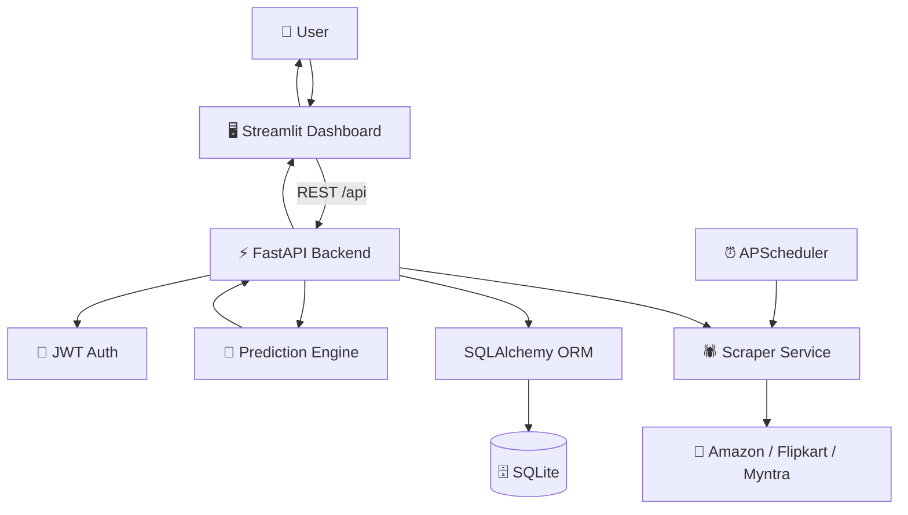
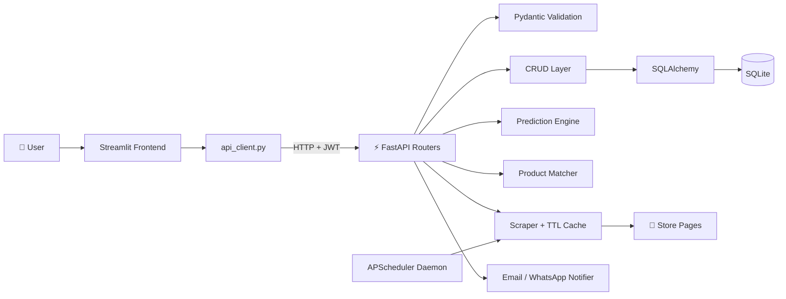
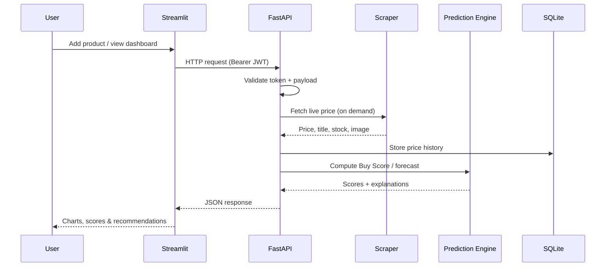
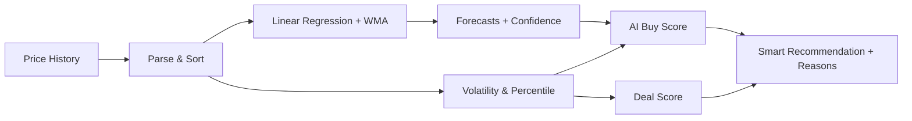
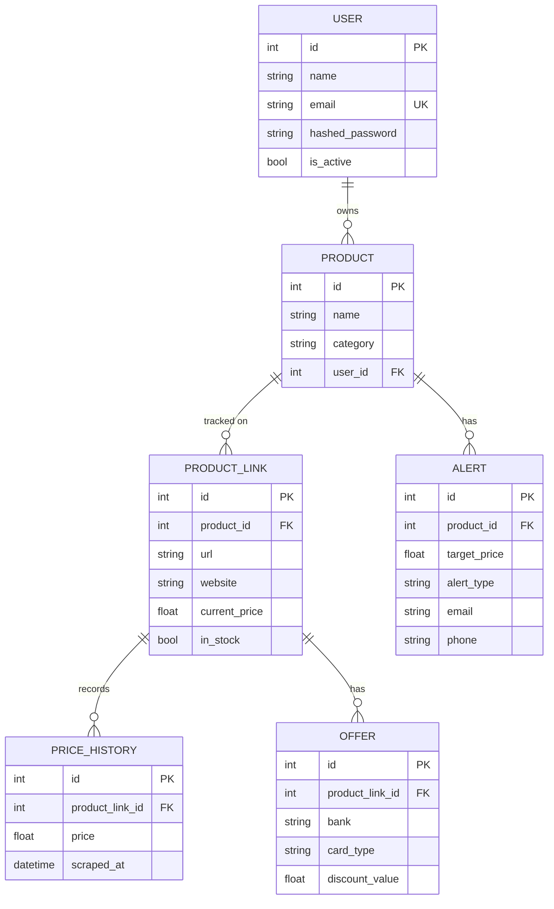

<div align="center">

# 🎯 PricePulse

### AI-Powered Multi-Store Price Tracker & Shopping Intelligence Platform

*Track any product across Amazon, Flipkart & Myntra — and let a custom AI engine tell you exactly when to buy.*

<br>

<p align="center">


</p>

<br>


</div>

---

# 🌟 Overview

**PricePulse** is an AI-powered price tracking and shopping intelligence platform that monitors product prices across multiple e-commerce websites — **Amazon, Flipkart, and Myntra** — and helps you make smarter buying decisions.

Instead of manually refreshing product pages and guessing whether "₹49,999" is actually a good deal, PricePulse continuously scrapes prices in the background, stores a complete price history, and runs every product through a **custom-built prediction engine**. That engine produces an **AI Buy Score**, a **Deal Score**, price forecasts, and a plain-English recommendation such as **BUY NOW**, **GOOD DEAL**, **WAIT**, or **NOT RECOMMENDED** — each backed by a transparent, human-readable rationale.

> 💡 **About the "AI":** PricePulse does **not** depend on an external Large Language Model or paid AI API. Its intelligence is a **home-grown, explainable statistical engine** (linear regression + weighted moving averages + weighted scoring) that runs locally with **zero API cost**. Every score comes with the exact reasons behind it — nothing is a black box.

Built with **FastAPI**, **SQLAlchemy**, and **Streamlit**, the project demonstrates a clean, modular, production-minded architecture: a REST API backend, a separate interactive dashboard, background scheduling, caching, authentication, and a real automated test suite.

---

# 🎯 Problem Statement

Online prices change constantly, and finding the genuinely best deal is painful:

- 🔄 Prices fluctuate daily across Amazon, Flipkart, and Myntra
- 🕵️ You have no idea if today's price is high, low, or "typical" versus history
- 💸 Bank/card offers make the *effective* price different from the *listed* price
- 📉 You miss price drops because you can't watch every product 24/7
- 🧩 The same product has different titles/URLs on every store, making comparison hard
- ⏳ "Should I buy now or wait?" is mostly guesswork

**PricePulse solves this** by giving you one platform that:

- Tracks a product across multiple stores under a single entry
- Records full price history and detects real price drops
- Scores every deal objectively against its own history
- Forecasts where the price is likely heading
- Finds the cheapest *effective* price after bank offers
- Alerts you by **email or WhatsApp** the moment your target price is hit

---

# ✨ Key Features

<table>
<tr>
<td width="33%">

## 🛰️ Multi-Store Tracking
- Amazon, Flipkart & Myntra scrapers
- One product → many store links
- Full price history timeline
- Automatic background price checks
- Cross-store price comparison
- Best-deal & savings detection

</td>
<td width="33%">

## 🧠 AI Intelligence
- **AI Buy Score** (0–100 + ★ rating)
- **Deal Score** vs. historical range
- Price forecasts (WMA + regression)
- Smart BUY / WAIT recommendations
- Target-price probability & wait time
- Portfolio-wide AI summary

</td>
<td width="33%">

## 🔔 Alerts & Savings
- Target-price alerts
- **Email + WhatsApp** notifications
- Bank-offer payment optimizer
- Cross-store product matching
- Secure JWT user accounts
- Personal, per-user watchlists

</td>
</tr>
</table>

---

# 📸 Application Preview

> **Screenshots will be added here after deployment.**

| Dashboard | Price Comparison | AI Buy Score |
|-----------|------------------|--------------|
|  |  |  |

| Price History | Payment Optimizer | Alerts |
|---------------|-------------------|--------|
|  |  |  |

---

# 🚀 Tech Stack

| Category | Technology |
|----------|------------|
| **Programming Language** | Python 3.10+ |
| **Backend / API** | FastAPI + Uvicorn |
| **Frontend** | Streamlit |
| **Database ORM** | SQLAlchemy 2.0 |
| **Database** | SQLite |
| **Validation** | Pydantic v2 + pydantic-settings |
| **Web Scraping** | BeautifulSoup4 + Requests |
| **Background Jobs** | APScheduler |
| **Authentication** | JWT (PyJWT) + bcrypt |
| **Notifications** | SMTP (email) + Twilio (WhatsApp) |
| **Prediction Engine** | Custom (Linear Regression + Weighted Moving Average) |
| **Monitoring** | psutil + structured logging |

---

# 🏗 High-Level Architecture



---

# 📑 Table of Contents

- [Overview](#-overview)
- [Problem Statement](#-problem-statement)
- [Key Features](#-key-features)
- [Tech Stack](#-tech-stack)
- [System Architecture](#-system-architecture)
- [Request Lifecycle](#-request-lifecycle)
- [Project Structure](#-project-structure)
- [Directory Overview](#-directory-overview)
- [The Intelligence Engine](#-the-intelligence-engine)
- [Getting Started](#-getting-started)
- [API Documentation](#-api-documentation)
- [Database Design](#-database-design)
- [Scheduler & Performance](#-background-scheduler--performance)
- [Testing](#-testing)
- [Security](#-security-considerations)
- [Deployment](#-deployment)
- [Future Roadmap](#-future-roadmap)
- [Contributing](#-contributing)
- [License](#-license)
- [Author](#-author)

---

# 🏛️ System Architecture

PricePulse follows a modular, layered architecture that cleanly separates the dashboard, the REST API, the intelligence layer, background jobs, and the database. This keeps every concern independent and makes the system easy to maintain, test, and scale.



---

# 🔄 Request Lifecycle

Every interaction flows through a predictable, validated pipeline.



---

# 📂 Project Structure

```text
amazon price tracking
│
├── 📁 backend
│   └── 📁 app
│       ├── 📄 main.py              # FastAPI entry point, middleware, router registration
│       ├── 📄 crud.py              # Database CRUD + business logic
│       ├── 📄 database.py          # Engine, session, query profiling
│       ├── 📄 models.py            # SQLAlchemy ORM models
│       ├── 📄 schemas.py           # Pydantic request/response schemas
│       ├── 📄 dependencies.py      # Auth dependency (get_current_user)
│       ├── 📄 migrations.py        # Auto index/migration on startup
│       ├── 📄 config_logging.py    # Centralized logging setup
│       │
│       ├── 📁 routers              # REST API endpoints
│       │   ├── 📄 auth.py          # Register / login / profile / password reset
│       │   ├── 📄 products.py      # Products, comparison, payment, matching
│       │   ├── 📄 links.py         # Store links, manual price checks, history
│       │   ├── 📄 alerts.py        # Target-price alerts
│       │   ├── 📄 analytics.py     # Prediction, deal score, portfolio summary
│       │   └── 📄 scheduler.py     # Scheduler status, cache stats, manual trigger
│       │
│       └── 📁 services             # Core logic & integrations
│           ├── 📄 auth.py          # JWT + bcrypt
│           ├── 📄 prediction.py    # 🧠 AI Buy Score & forecasting engine
│           ├── 📄 product_matcher.py # Cross-store fuzzy product matching
│           ├── 📄 scraper.py       # Router + TTL cache + session pooling
│           ├── 📄 scheduler.py     # APScheduler background price checks
│           ├── 📄 notifier.py      # Email (SMTP) alerts
│           ├── 📄 whatsapp.py      # WhatsApp (Twilio) alerts
│           └── 📁 scrapers
│               ├── 📄 amazon.py
│               ├── 📄 flipkart.py
│               └── 📄 myntra.py
│
├── 📁 frontend
│   ├── 📄 app.py                   # Streamlit dashboard (UI)
│   └── 📄 api_client.py            # Typed HTTP client for the backend API
│
├── 📄 requirements.txt
├── 📄 how_to_run.txt
├── 📄 PERFORMANCE_REPORT.md        # Benchmarks & optimization write-up
├── 📄 test_*.py                    # Pytest suite (auth, analytics, scrapers, …)
├── 📄 stress_test.py               # Load test (500 products / 1000 logs)
└── 📄 README.md
```

---

# 📂 Directory Overview

The codebase is intentionally split so every file has a single, clear responsibility.

## 📁 backend/app/ — The API Core

### 📄 main.py
The application entry point. Initializes FastAPI, configures CORS, registers a performance-logging middleware, runs automatic migrations, creates database tables, starts/stops the background scheduler on the app lifecycle, and mounts every router under the `/api` prefix.

### 📄 crud.py
The data-access and business-logic layer. All reads/writes for products, links, price history, alerts, offers, analytics, and product matching flow through here — keeping SQL concerns out of the routers.

### 📄 database.py
Creates the SQLAlchemy engine and session factory. The database target is configurable via the `DATABASE_URL` environment variable (defaults to a local SQLite file). It also registers query-timing event hooks for performance profiling.

### 📄 models.py
Defines the ORM schema: `User`, `Product`, `ProductLink`, `PriceHistory`, `Alert`, and `Offer`, along with their relationships and cascade rules.

### 📄 schemas.py
Every Pydantic model used for request validation and response shaping — giving the API automatic validation, type safety, and self-documenting Swagger output.

## 📁 backend/app/routers/ — REST Endpoints
Six routers group the API by domain: **auth**, **products**, **links**, **alerts**, **analytics**, and **scheduler**. Every protected endpoint uses the `get_current_user` dependency so data is always scoped to the authenticated user.

## 📁 backend/app/services/ — Logic & Integrations
The heart of the application: the **prediction engine**, **product matcher**, **scraper** (with a thread-safe TTL cache and connection pooling), the **APScheduler daemon**, and the **email/WhatsApp notifiers**. Isolating these means the AI logic or a scraper can be swapped without touching the API layer.

## 📁 frontend/
A **Streamlit** dashboard (`app.py`) backed by a clean, typed API client (`api_client.py`). It handles authentication, product management, interactive charts, and lazy-loaded analytics — talking to the backend purely over REST.

---

# 🧠 The Intelligence Engine

This is what makes PricePulse more than a scraper. Everything below is computed **locally** in `services/prediction.py` and `services/product_matcher.py` — **no external AI API required** — and every result ships with human-readable reasons.

### 📈 Price Forecasting
Combines two classic techniques for a stable prediction:

- **Linear Trend Regression (OLS):** fits `price = m·t + c` over the price history to detect the underlying trend and its strength (R²).
- **Weighted Moving Average (WMA):** emphasizes the most recent observations.

These are blended to forecast **tomorrow**, **next week**, and **30-day** prices, each with a **confidence level** derived from R² and price volatility.

### 🏆 AI Buy Score (0–100)
A weighted composite score answering *"is now a good time to buy?"*:

| Signal | Weight |
|--------|--------|
| Price vs. lowest ever | 25% |
| Distance from target price | 25% |
| Price vs. historical average | 20% |
| Price trend (falling/stable/rising) | 15% |
| Historical success rate at this price | 15% |

The score maps to a ★ rating and a **Smart Recommendation**: `BUY NOW`, `GOOD DEAL`, `WAIT`, or `NOT RECOMMENDED`, plus an estimated **wait time** and **probability of hitting your target**.

### 🎯 Deal Score
Independent of your target price, the Deal Score rates *where today's price sits within its own historical range* (percentile-based, adjusted for trend and average) and labels it **LOW**, **TYPICAL**, or **HIGH**.

### 🔗 Cross-Store Product Matching
Detects when the same product appears on different stores using layered signals: **model-number extraction** (e.g. `WH-1000XM5`), **brand detection**, **URL identifiers** (Amazon ASIN, Flipkart `itm…`, Myntra IDs), and **fuzzy title similarity** (SequenceMatcher + Jaccard). Returns ranked suggestions with confidence scores — it never auto-merges, leaving the final decision to you.

### 💳 Payment / Bank-Offer Optimizer
Applies stored bank-card offers (percentage or flat, with min-purchase and max-discount rules) to compute the cheapest **effective** price across all stores and payment methods.



---

# 🚀 Getting Started

## 📋 Prerequisites

| Requirement | Version |
|-------------|---------|
| Python | 3.10 or later |
| pip | Latest |
| Git | Latest |

## 📥 1. Clone the Repository

```bash
git clone https://github.com/psyccho00/PricePulse-AI_Price_Tracker.git
cd PricePulse-AI_Price_Tracker
```

## 🧪 2. Create a Virtual Environment

```bash
# Windows
python -m venv .venv
.\.venv\Scripts\Activate

# macOS / Linux
python3 -m venv .venv
source .venv/bin/activate
```

## 📦 3. Install Dependencies

```bash
pip install -r requirements.txt
```

## ⚙️ 4. Configure Environment Variables

Create a `.env` file in the project root. **Every value below is optional** — the app falls back to sensible defaults, and notifications simply log to a file if credentials are absent.

```env
# Database (defaults to local SQLite)
DATABASE_URL=sqlite:///./price_tracker.db

# Security — set a strong random value in production
JWT_SECRET_KEY=change_this_to_a_long_random_secret

# Scheduler & scraper tuning
CHECK_INTERVAL_MINUTES=60
MAX_SCRAPER_WORKERS=8
CACHE_TTL_SECONDS=600

# Email alerts (SMTP)
SMTP_ADDRESS=smtp.gmail.com
EMAIL_ADDRESS=your_email@gmail.com
EMAIL_PASSWORD=your_app_password

# WhatsApp alerts (Twilio) — optional
TWILIO_ACCOUNT_SID=your_sid
TWILIO_AUTH_TOKEN=your_token
TWILIO_FROM_WHATSAPP=whatsapp:+14155238886
```

> 🔒 **Never commit your real `.env` file.** Add it to `.gitignore` and keep secrets out of version control.

## ▶️ 5. Run the Application

PricePulse runs as **two processes** — the API and the dashboard. Open two terminals (with the virtual environment activated in both).

**Terminal 1 — Backend API** (serves on `http://localhost:8000`):

```bash
python -m uvicorn backend.app.main:app --reload
```

**Terminal 2 — Frontend Dashboard** (opens on `http://localhost:8501`):

```bash
python -m streamlit run frontend/app.py
```

> ℹ️ The dashboard expects the backend at `http://localhost:8000` (configured in `frontend/api_client.py`). Run the backend on the default port so the two connect.

---

# 📚 API Documentation

FastAPI auto-generates interactive documentation. Once the backend is running:

- **Swagger UI** → `http://localhost:8000/docs`
- **ReDoc** → `http://localhost:8000/redoc`

All endpoints are mounted under the `/api` prefix and (except registration/login) require a **Bearer JWT** token.

### 🔐 Authentication — `/api/auth`
| Method | Endpoint | Description |
|--------|----------|-------------|
| `POST` | `/register` | Create a new user account |
| `POST` | `/login` | Obtain a JWT access token |
| `GET`  | `/me` | Get the current user's profile |
| `PUT`  | `/me` | Update name / email |
| `PUT`  | `/me/password` | Change password |
| `POST` | `/forgot-password` | Generate a reset token |
| `POST` | `/reset-password` | Reset password using a token |

### 📦 Products — `/api/products`
| Method | Endpoint | Description |
|--------|----------|-------------|
| `GET`  | `/` | List all tracked products |
| `POST` | `/` | Create a product (with optional first link) |
| `GET`  | `/{id}` | Product detail (links + alerts) |
| `DELETE` | `/{id}` | Delete a product |
| `GET`  | `/{id}/comparison` | Cross-store price comparison |
| `GET`  | `/{id}/payment-optimization` | Best effective price after bank offers |
| `GET`  | `/{id}/match-suggestions` | Suggested matching products on other stores |

### 🔗 Links — `/api/links`
| Method | Endpoint | Description |
|--------|----------|-------------|
| `POST` | `/` | Add a store link to a product |
| `DELETE` | `/{id}` | Remove a link |
| `POST` | `/{id}/check` | Scrape the live price right now |
| `POST` | `/{id}/price` | Record a manual/test price |
| `GET`  | `/{id}/history` | Price history for a link |

### 🔔 Alerts — `/api/alerts`
| Method | Endpoint | Description |
|--------|----------|-------------|
| `GET`  | `/` | List alerts (optionally by product) |
| `POST` | `/` | Create a target-price alert |
| `DELETE` | `/{id}` | Delete an alert |

### 📊 Analytics — `/api/analytics`
| Method | Endpoint | Description |
|--------|----------|-------------|
| `GET` | `/{id}/history` | Full price history |
| `GET` | `/{id}/summary` | Lowest / highest / average, per store |
| `GET` | `/{id}/target-analysis` | How often price dropped below a target |
| `GET` | `/{id}/prediction` | 🧠 Forecast + AI Buy Score |
| `GET` | `/{id}/deal-score` | Deal Score & percentile |
| `GET` | `/{id}/price-drop` | Recent drop & historical-low detection |
| `GET` | `/portfolio-ai-summary` | AI overview across all products |

### ⏰ Scheduler — `/api/scheduler`
| Method | Endpoint | Description |
|--------|----------|-------------|
| `GET`  | `/status` | Background scheduler state & next run |
| `GET`  | `/cache-stats` | Scraper cache telemetry |
| `POST` | `/trigger` | Run a price-check pass immediately |

### 📡 Example Request

```http
POST /api/auth/register
Content-Type: application/json
```

```json
{
  "name": "Joydeep",
  "email": "joydeep@example.com",
  "password": "a-strong-password"
}
```

Then fetch a prediction (with a Bearer token):

```http
GET /api/analytics/1/prediction?target_price=49999
Authorization: Bearer <your_jwt_token>
```

```json
{
  "product_id": 1,
  "current_price": 52999,
  "ai_buy_score": 82,
  "star_rating": "★★★★★",
  "smart_recommendation": "BUY NOW",
  "smart_recommendation_reason": "Current price is at its historical lowest and close to target.",
  "predicted_price_next_week": 52450,
  "deal_score": 88,
  "deal_status": "LOW",
  "confidence": "High"
}
```

---

# 🗄️ Database Design

PricePulse uses **SQLite** via **SQLAlchemy ORM**. On startup, tables are created automatically and key indexes are applied by `migrations.py` for fast lookups.



---

# ⏰ Background Scheduler & Performance

A key strength of PricePulse is its **automated, optimized** price-checking pipeline.

- **APScheduler** runs a background job every `CHECK_INTERVAL_MINUTES` (default 60) that re-scrapes every active link.
- **Parallel scraping** via `ThreadPoolExecutor` (`MAX_SCRAPER_WORKERS`, default 8) — network requests run concurrently, while database writes are committed sequentially in a single transaction to keep SQLite safe.
- **Retry logic** automatically re-attempts failed scrapes.
- **TTL cache + connection pooling** in the scraper eliminate redundant network calls and TCP/TLS handshakes.

Documented benchmarks (from `PERFORMANCE_REPORT.md`, under a 500-product / 1,000-log stress test):

| Metric | Before | After | Improvement |
|--------|--------|-------|-------------|
| Dashboard load time | ~4.20 s | **0.08 s** | **98%** |
| DB queries per load | 1,005 | **2** | **99.8%** |
| Scheduler run (500 items) | 16.1 s | **3.2 s** | **80%** |
| Avg scraper fetch / site | 1.84 s | **0.42 s** | **77%** |

---

# 🧪 Testing

The project ships with a real **pytest** suite covering the major subsystems:

| Test file | Focus |
|-----------|-------|
| `test_auth.py` | Registration, login, JWT, password flows |
| `test_backend_api.py` | Core product/link/alert endpoints |
| `test_analytics.py` | History, summaries, target analysis |
| `test_ai_intelligence.py` | Buy Score / prediction engine |
| `test_shopping_intelligence.py` | Deal score, price-drop, matching |
| `test_comparison.py` | Cross-store comparison logic |
| `test_scrapers.py` | Scraper parsing |
| `test_production.py` | Production/perf behavior |
| `stress_test.py` | Load test (500 products / 1,000 logs) |

Run the suite with:

```bash
pytest
```

---

# 🔒 Security Considerations

This project is built as a learning and portfolio application. It already implements:

- 🔑 **JWT authentication** with 30-minute token expiry
- 🧂 **bcrypt** password hashing (salted)
- 🔐 Per-user data isolation on every protected endpoint
- 🙈 Password-reset flow that avoids user enumeration

For production, harden further by:

- Setting a strong `JWT_SECRET_KEY` via environment variable (do not rely on the built-in fallback)
- Keeping `.env` out of version control and rotating any key that was ever committed
- Restricting CORS to known origins (currently open to `*`)
- Serving over HTTPS and adding rate limiting
- Migrating from SQLite to PostgreSQL for concurrent writes

---

# ☁ Deployment

The modular design supports multiple deployment targets:

| Platform | Suitable |
|----------|----------|
| Render | ✅ |
| Railway | ✅ |
| AWS | ✅ |
| Azure | ✅ |
| Google Cloud | ✅ |
| Docker | ✅ |

The API and dashboard can be deployed as two services, with SQLite swapped for a managed PostgreSQL instance via the `DATABASE_URL` variable.

---

# 🛣️ Future Roadmap

## 🧠 Intelligence
- More stores (Croma, Reliance Digital, Ajio)
- Seasonal / sale-event awareness (Big Billion Days, Great Indian Festival)
- Anomaly detection for fake "inflated then discounted" pricing
- Personalized buy-timing based on user history

## ❤️ Features
- Browser extension for one-click tracking
- Public price-history charts per product
- Wishlist sharing & price-drop leaderboards
- Configurable alert frequency & quiet hours

## 🔐 Platform
- Google / GitHub OAuth login
- Email verification & proper reset emails
- Role-based access control
- Proxy rotation for high-volume scraping

---

# 🤝 Contributing

Contributions are welcome!

1. **Fork** the repository
2. **Clone** your fork
   ```bash
   git clone https://github.com/your-username/PricePulse-AI_Price_Tracker.git
   ```
3. **Create a branch**
   ```bash
   git checkout -b feature/your-feature
   ```
4. **Commit** your changes with a clear message
5. **Push** and open a **Pull Request**

Please keep the existing modular structure, write meaningful commit messages, and add tests where relevant.

---

# 📄 License

This project is licensed under the **MIT License** — free to use, modify, and distribute for educational and personal purposes.

> 📌 *Add a `LICENSE` file to the repository root so the license badge and terms are official.*

---

# 👨‍💻 Author

<div align="center">

## Joydeep

**Mechanical Engineering Graduate | AI & Data Science Enthusiast**

Building intelligent applications with modern AI techniques, scalable backend systems, and clean software architecture.

### Technical Skills
🐍 Python • ⚡ FastAPI • 🎨 Streamlit • 🗄 SQLAlchemy • SQLite • 🧠 Prediction Engines • 🕷️ Web Scraping • 🔐 JWT Auth

</div>

---

# 🌟 Support the Project

If you found PricePulse helpful or interesting:

- ⭐ Star the repository
- 🍴 Fork the project
- 🐛 Report bugs
- 💡 Suggest new features

---

# 🙏 Acknowledgements

Built with these excellent open-source tools:

- FastAPI & Uvicorn
- Streamlit
- SQLAlchemy
- BeautifulSoup & Requests
- APScheduler
- Pydantic

<div align="center">

# 🎯 PricePulse

### *Track smarter. Buy at the right time.*

Made with ❤️ using Python, FastAPI, Streamlit, and a custom AI prediction engine.

**⭐ If you like this project, consider giving it a Star!**

</div>
